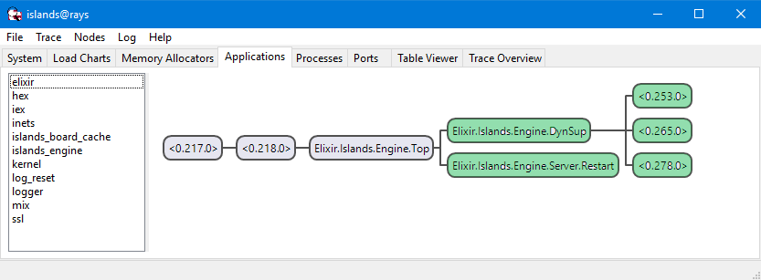

# Islands Engine

[](https://travis-ci.org/RaymondLoranger/islands_engine)

Models the _Game of Islands_.

##### Based on the book [Functional Web Development](https://pragprog.com/titles/lhelph/functional-web-development-with-elixir-otp-and-phoenix/) by Lance Halvorsen.

## Installation

Add `islands_engine` to your list of dependencies in `mix.exs`:

```elixir
def deps do
  [
    {:islands_engine, "~> 0.1"}
  ]
end
```

## Supervision Tree

The highlighted processes below (supervisor and servers) are fault-tolerant:
if any crashes (or is killed), it is immediately restarted and the system
remains undisturbed.

The processes identified by their PIDs are game servers: each holds a game
struct as its state. Multiple games can be played simultaneously.

## 
